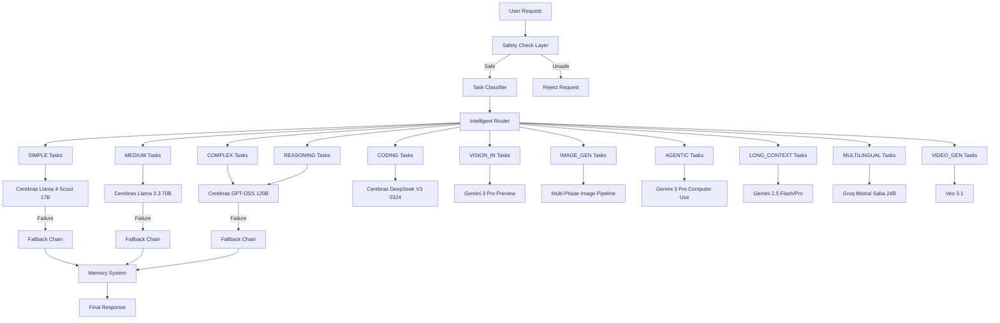
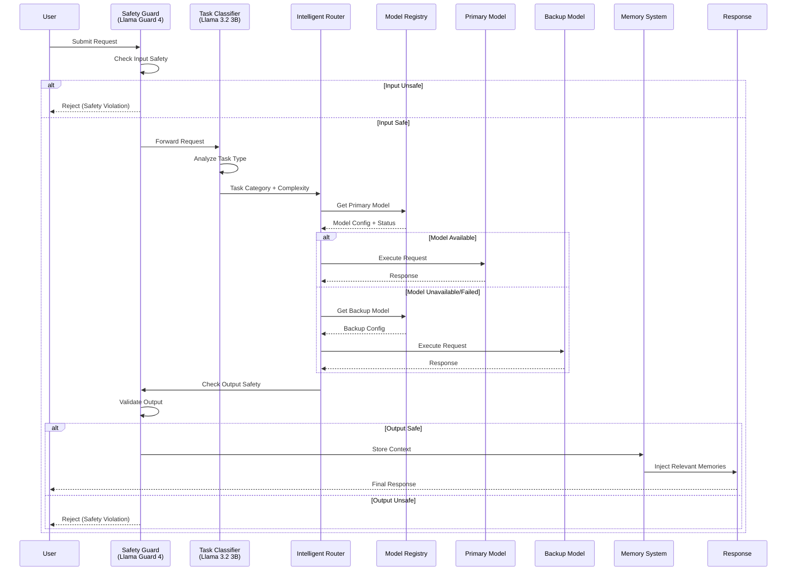

# Design Document: CODEEX V3.3 Multi-Model AI Router

## Overview

CODEEX V3.3 is a comprehensive $0 multimodal AI agent that intelligently routes user requests across 30+ AI models from 5 providers (Groq, Cerebras, Google AI Studio, Hugging Face, ElevenLabs) based on task complexity, type, and model availability. The system implements a sophisticated classification and routing pipeline with automatic fallback chains, model lifecycle management, and graceful degradation to ensure 100% uptime while operating entirely on free tier limits.

The router acts as a unified interface that abstracts away provider-specific APIs, rate limits, and model deprecation cycles, providing users with seamless access to the best available model for each task without manual selection. Key innovations include safety-first architecture with Llama Guard 4, intelligent task classification, multi-tier fallback chains, and automatic context chunking for long-context scenarios exceeding 1M tokens.

## Architecture

### High-Level System Architecture



### Request Processing Flow




## Components and Interfaces

### Component 1: Model Registry & Lifecycle Manager

**Purpose**: Centralized registry tracking all 30+ models across 5 providers with lifecycle status, deprecation dates, and availability monitoring.

**Interface**:
```typescript
interface ModelLifecycleStatus {
  status: 'ACTIVE' | 'DYING' | 'DEAD';
  deprecationDate?: string;
  replacementModelId?: string;
  lastHealthCheck?: string;
}

interface ExtendedModelConfig {
  // Existing fields from current ModelConfig
  id: string;
  name: string;
  provider: ProviderType;
  modelId: string;
  category: ModelCategory;
  description: string;
  contextWindow: number;
  supportsStreaming: boolean;
  defaultParams: ModelParams;
  enabled: boolean;
  
  // New V3.3 fields
  lifecycle: ModelLifecycleStatus;
  capabilities: ModelCapability[];
  rateLimit: RateLimitConfig;
  costPerToken?: number; // For future paid tier
  priority: number; // Higher = preferred in fallback chains
}

interface ModelCapability {
  type: 'TEXT' | 'VISION' | 'AUDIO_IN' | 'AUDIO_OUT' | 'IMAGE_GEN' | 'VIDEO_GEN' | 'COMPUTER_USE';
  maxInputSize?: number;
  supportedFormats?: string[];
}

interface RateLimitConfig {
  requestsPerMinute: number;
  requestsPerDay?: number;
  tokensPerMinute?: number;
}

interface ModelRegistryV3 {
  // Existing methods
  getModel(id: string): ExtendedModelConfig | undefined;
  getAvailableModels(): ExtendedModelConfig[];
  isModelAvailable(id: string): boolean;
  
  // New V3.3 methods
  getModelsByCapability(capability: ModelCapability['type']): ExtendedModelConfig[];
  getActiveModels(): ExtendedModelConfig[];
  getModelsByLifecycle(status: ModelLifecycleStatus['status']): ExtendedModelConfig[];
  getFallbackChain(taskCategory: TaskCategory): ExtendedModelConfig[];
  markModelDead(id: string, replacementId?: string): void;
  checkModelHealth(id: string): Promise<boolean>;
  getModelUsageStats(id: string): ModelUsageStats;
}

interface ModelUsageStats {
  totalRequests: number;
  successRate: number;
  averageLatency: number;
  lastUsed: string;
  errorCount: number;
}
```

**Responsibilities**:
- Track model lifecycle status (ACTIVE/DYING/DEAD)
- Monitor deprecation dates and auto-migrate to replacements
- Perform periodic health checks on all models
- Maintain fallback chain priorities
- Track usage statistics for optimization
- Handle model capability queries


### Component 2: Safety Guard System

**Purpose**: Dual-layer safety checking using Groq Llama Guard 4 12B for input and output validation.

**Interface**:
```typescript
interface SafetyCheckRequest {
  content: string;
  type: 'INPUT' | 'OUTPUT';
  context?: string;
}

interface SafetyCheckResult {
  isSafe: boolean;
  violations: SafetyViolation[];
  confidence: number;
  category?: SafetyCategory;
}

interface SafetyViolation {
  type: SafetyCategory;
  severity: 'LOW' | 'MEDIUM' | 'HIGH' | 'CRITICAL';
  description: string;
}

type SafetyCategory = 
  | 'HATE_SPEECH'
  | 'VIOLENCE'
  | 'SEXUAL_CONTENT'
  | 'SELF_HARM'
  | 'DANGEROUS_CONTENT'
  | 'HARASSMENT'
  | 'ILLEGAL_ACTIVITY';

interface SafetyGuardService {
  checkInput(request: SafetyCheckRequest): Promise<SafetyCheckResult>;
  checkOutput(request: SafetyCheckRequest): Promise<SafetyCheckResult>;
  isEnabled(): boolean;
  getViolationHistory(userId: string): SafetyViolation[];
}
```

**Responsibilities**:
- Validate all user inputs before processing
- Validate all model outputs before returning to user
- Track violation patterns per user
- Provide detailed violation feedback
- Support bypass for trusted users (future feature)

### Component 3: Task Classifier

**Purpose**: Intelligent classification of user requests into 11 task categories using Groq Llama 3.2 3B.

**Interface**:
```typescript
type TaskCategory = 
  | 'SIMPLE'           // Basic queries, greetings, simple facts
  | 'MEDIUM'           // General knowledge, explanations
  | 'COMPLEX'          // Multi-step reasoning, analysis
  | 'CODING'           // Code generation, debugging, review
  | 'REASONING'        // Logic puzzles, math, strategic thinking
  | 'VISION_IN'        // Image understanding, OCR, visual Q&A
  | 'IMAGE_GEN'        // Image generation requests
  | 'VIDEO_GEN'        // Video generation requests
  | 'MULTILINGUAL'     // Non-English or translation tasks
  | 'AGENTIC'          // Computer use, tool calling, automation
  | 'LONG_CONTEXT';    // Requests requiring >100K tokens context

interface ClassificationRequest {
  userMessage: string;
  conversationHistory?: Message[];
  attachments?: Attachment[];
}

interface ClassificationResult {
  category: TaskCategory;
  confidence: number;
  reasoning: string;
  estimatedComplexity: 'LOW' | 'MEDIUM' | 'HIGH';
  estimatedTokens: number;
  requiresMultimodal: boolean;
}

interface TaskClassifierService {
  classify(request: ClassificationRequest): Promise<ClassificationResult>;
  reclassify(request: ClassificationRequest, previousCategory: TaskCategory): Promise<ClassificationResult>;
  getClassificationHistory(userId: string): ClassificationResult[];
}
```

**Responsibilities**:
- Analyze user request content and context
- Detect task type and complexity
- Estimate token requirements
- Identify multimodal needs
- Support reclassification on failure


### Component 4: Intelligent Router

**Purpose**: Core routing engine that maps classified tasks to optimal models with automatic fallback handling.

**Interface**:
```typescript
interface RoutingRequest {
  classification: ClassificationResult;
  userMessage: string;
  conversationHistory?: Message[];
  userPreferences?: UserRoutingPreferences;
  attachments?: Attachment[];
}

interface RoutingResult {
  selectedModel: ExtendedModelConfig;
  fallbackChain: ExtendedModelConfig[];
  routingReason: string;
  estimatedLatency: number;
}

interface UserRoutingPreferences {
  preferredProviders?: ProviderType[];
  avoidProviders?: ProviderType[];
  prioritizeSpeed?: boolean;
  prioritizeQuality?: boolean;
}

interface IntelligentRouterService {
  route(request: RoutingRequest): Promise<RoutingResult>;
  executeWithFallback(routing: RoutingResult, request: GenerateRequest): Promise<GenerateResponse>;
  getRoutingStats(): RoutingStatistics;
  updateRoutingRules(rules: RoutingRule[]): void;
}

interface RoutingRule {
  category: TaskCategory;
  primaryModelId: string;
  fallbackModelIds: string[];
  conditions?: RoutingCondition[];
}

interface RoutingCondition {
  type: 'TOKEN_COUNT' | 'PROVIDER_AVAILABLE' | 'TIME_OF_DAY' | 'USER_TIER';
  operator: 'GT' | 'LT' | 'EQ' | 'IN';
  value: any;
}

interface RoutingStatistics {
  totalRequests: number;
  routingsByCategory: Record<TaskCategory, number>;
  fallbackRate: number;
  averageLatency: number;
  providerDistribution: Record<ProviderType, number>;
}
```

**Responsibilities**:
- Map task categories to optimal models
- Build fallback chains based on model priority
- Execute requests with automatic retry logic
- Track routing statistics and patterns
- Support dynamic routing rule updates
- Handle provider-level failures gracefully


### Component 5: Fallback Chain Manager

**Purpose**: Manages multi-tier fallback chains with exponential backoff and intelligent retry logic.

**Interface**:
```typescript
interface FallbackChainConfig {
  category: TaskCategory;
  chain: FallbackTier[];
  maxRetries: number;
  backoffStrategy: 'EXPONENTIAL' | 'LINEAR' | 'FIXED';
  initialDelayMs: number;
}

interface FallbackTier {
  modelId: string;
  priority: number;
  conditions?: FallbackCondition[];
}

interface FallbackCondition {
  errorType: 'RATE_LIMIT' | 'TIMEOUT' | 'AUTH_ERROR' | 'SERVICE_UNAVAILABLE' | 'MODEL_ERROR';
  shouldFallback: boolean;
}

interface FallbackExecution {
  attemptNumber: number;
  modelId: string;
  success: boolean;
  error?: Error;
  latency: number;
  timestamp: string;
}

interface FallbackChainManager {
  executeWithFallback(
    request: GenerateRequest,
    chain: ExtendedModelConfig[]
  ): Promise<GenerateResponse>;
  
  getFallbackHistory(requestId: string): FallbackExecution[];
  updateFallbackChain(category: TaskCategory, chain: FallbackTier[]): void;
  getChainPerformance(category: TaskCategory): ChainPerformanceMetrics;
}

interface ChainPerformanceMetrics {
  category: TaskCategory;
  totalExecutions: number;
  primarySuccessRate: number;
  averageFallbackDepth: number;
  mostReliableModel: string;
  leastReliableModel: string;
}
```

**Responsibilities**:
- Execute requests through fallback chains
- Implement exponential backoff between retries
- Track fallback execution history
- Analyze chain performance metrics
- Dynamically adjust chain priorities based on success rates
- Handle provider-specific error conditions


### Component 6: Memory System

**Purpose**: Vector-based memory storage using Google embeddings and Firestore for context-aware responses.

**Interface**:
```typescript
interface MemoryEntry {
  id: string;
  userId: string;
  content: string;
  embedding: number[];
  metadata: MemoryMetadata;
  createdAt: string;
  lastAccessed: string;
  accessCount: number;
}

interface MemoryMetadata {
  category: 'PREFERENCE' | 'FACT' | 'CONTEXT' | 'SKILL' | 'CONVERSATION';
  importance: number; // 0-1 score
  tags: string[];
  relatedMemoryIds?: string[];
}

interface MemoryQuery {
  userId: string;
  queryText: string;
  topK?: number;
  minSimilarity?: number;
  categories?: MemoryMetadata['category'][];
}

interface MemorySearchResult {
  memory: MemoryEntry;
  similarity: number;
  relevanceScore: number;
}

interface MemorySystemService {
  // Storage operations
  storeMemory(userId: string, content: string, metadata: MemoryMetadata): Promise<MemoryEntry>;
  updateMemory(memoryId: string, updates: Partial<MemoryEntry>): Promise<void>;
  deleteMemory(memoryId: string): Promise<void>;
  
  // Retrieval operations
  searchMemories(query: MemoryQuery): Promise<MemorySearchResult[]>;
  getRecentMemories(userId: string, limit: number): Promise<MemoryEntry[]>;
  getMemoriesByCategory(userId: string, category: MemoryMetadata['category']): Promise<MemoryEntry[]>;
  
  // Embedding operations
  generateEmbedding(text: string): Promise<number[]>;
  calculateSimilarity(embedding1: number[], embedding2: number[]): number;
  
  // Context injection
  injectMemoriesIntoPrompt(prompt: string, memories: MemorySearchResult[]): string;
  
  // Maintenance
  pruneOldMemories(userId: string, olderThanDays: number): Promise<number>;
  consolidateMemories(userId: string): Promise<void>;
}
```

**Responsibilities**:
- Generate embeddings using gemini-embedding-001
- Store memories in Firestore with vector data
- Perform similarity search for relevant context
- Inject relevant memories into prompts
- Manage memory lifecycle and pruning
- Consolidate duplicate or outdated memories


### Component 7: Multimodal Handler

**Purpose**: Unified interface for handling voice, image, and video inputs/outputs across different providers.

**Interface**:
```typescript
interface MultimodalRequest {
  type: 'VOICE_IN' | 'VOICE_OUT' | 'IMAGE_IN' | 'IMAGE_OUT' | 'VIDEO_OUT';
  content: string | Buffer;
  options?: MultimodalOptions;
}

interface MultimodalOptions {
  // Voice options
  voice?: Voice;
  language?: string;
  
  // Image options
  imageFormat?: 'PNG' | 'JPEG' | 'WEBP';
  imageSize?: '256x256' | '512x512' | '1024x1024' | '1792x1024' | '1024x1792';
  imageQuality?: 'standard' | 'hd';
  
  // Video options
  videoDuration?: number;
  videoResolution?: '720p' | '1080p' | '4k';
  videoStyle?: string;
}

interface MultimodalResponse {
  type: MultimodalRequest['type'];
  content: string | Buffer;
  metadata: MultimodalMetadata;
}

interface MultimodalMetadata {
  provider: ProviderType;
  modelUsed: string;
  processingTime: number;
  fileSize?: number;
  format?: string;
}

interface MultimodalHandlerService {
  // Voice operations
  transcribeAudio(audio: Buffer, language?: string): Promise<string>;
  synthesizeSpeech(text: string, voice: Voice): Promise<Buffer>;
  
  // Image operations
  analyzeImage(image: Buffer, prompt: string): Promise<string>;
  generateImage(prompt: string, options?: MultimodalOptions): Promise<Buffer>;
  
  // Video operations
  generateVideo(prompt: string, options?: MultimodalOptions): Promise<Buffer>;
  
  // Fallback chains
  getVoiceFallbackChain(): string[];
  getImageGenFallbackChain(): string[];
}
```

**Responsibilities**:
- Handle voice input via Groq Whisper V3 Turbo
- Handle voice output via Groq PlayAI TTS → Gemini Native Audio → ElevenLabs
- Handle image input via Gemini 3 Pro Preview
- Handle image generation via 6-tier fallback chain
- Handle video generation via Veo 3.1
- Manage multimodal fallback chains


### Component 8: Rate Limiter & Queue Manager

**Purpose**: Manage rate limits across all providers with intelligent queuing and request batching.

**Interface**:
```typescript
interface RateLimitState {
  provider: ProviderType;
  requestsThisMinute: number;
  requestsToday: number;
  tokensThisMinute: number;
  resetAt: string;
  isThrottled: boolean;
}

interface QueuedRequest {
  id: string;
  priority: number;
  request: GenerateRequest;
  enqueuedAt: string;
  estimatedExecutionTime?: string;
}

interface RateLimiterService {
  // Rate limit checking
  canExecute(provider: ProviderType, estimatedTokens: number): boolean;
  getRateLimitState(provider: ProviderType): RateLimitState;
  waitForAvailability(provider: ProviderType): Promise<void>;
  
  // Request tracking
  recordRequest(provider: ProviderType, tokens: number): void;
  resetCounters(provider: ProviderType): void;
  
  // Queue management
  enqueueRequest(request: GenerateRequest, priority: number): Promise<string>;
  dequeueRequest(): Promise<QueuedRequest | null>;
  getQueueLength(provider?: ProviderType): number;
  cancelRequest(requestId: string): boolean;
  
  // Statistics
  getProviderStats(provider: ProviderType): ProviderRateLimitStats;
}

interface ProviderRateLimitStats {
  provider: ProviderType;
  totalRequests: number;
  throttledRequests: number;
  averageWaitTime: number;
  peakUsageTime: string;
  utilizationRate: number; // 0-1
}
```

**Responsibilities**:
- Track rate limits per provider (Groq: 30 RPM, Google: 15 RPM, etc.)
- Queue requests when rate limits are reached
- Implement priority-based request scheduling
- Provide wait time estimates
- Auto-reset counters at appropriate intervals
- Generate rate limit utilization reports


### Component 9: Context Chunker

**Purpose**: Automatically chunk and process requests exceeding 1M token context window.

**Interface**:
```typescript
interface ChunkingStrategy {
  type: 'SLIDING_WINDOW' | 'SEMANTIC' | 'HIERARCHICAL';
  chunkSize: number;
  overlapSize: number;
}

interface ChunkedRequest {
  originalRequest: GenerateRequest;
  chunks: RequestChunk[];
  strategy: ChunkingStrategy;
  totalTokens: number;
}

interface RequestChunk {
  id: string;
  content: string;
  tokenCount: number;
  sequenceNumber: number;
  metadata: ChunkMetadata;
}

interface ChunkMetadata {
  startPosition: number;
  endPosition: number;
  hasOverlap: boolean;
  relatedChunkIds: string[];
}

interface ChunkingResult {
  chunks: ResponseChunk[];
  synthesizedResponse: string;
  totalProcessingTime: number;
}

interface ResponseChunk {
  chunkId: string;
  response: string;
  modelUsed: string;
  processingTime: number;
}

interface ContextChunkerService {
  // Chunking operations
  shouldChunk(request: GenerateRequest): boolean;
  chunkRequest(request: GenerateRequest, strategy: ChunkingStrategy): ChunkedRequest;
  estimateTokenCount(text: string): number;
  
  // Processing operations
  processChunks(chunkedRequest: ChunkedRequest): Promise<ChunkingResult>;
  synthesizeResponses(chunks: ResponseChunk[]): string;
  
  // Strategy selection
  selectOptimalStrategy(request: GenerateRequest): ChunkingStrategy;
}
```

**Responsibilities**:
- Detect requests exceeding 1M token limit
- Chunk large contexts using optimal strategy
- Process chunks in parallel when possible
- Synthesize chunk responses into coherent output
- Maintain context continuity across chunks
- Handle chunk-level failures gracefully


## Data Models

### Model Configuration (Extended)

```typescript
interface ExtendedModelConfig {
  // Core identification
  id: string;                    // e.g., "cerebras-llama-4-scout-17b"
  name: string;                  // e.g., "Cerebras Llama 4 Scout 17B"
  provider: ProviderType;        // "groq" | "cerebras" | "google" | "huggingface" | "elevenlabs"
  modelId: string;               // Provider-specific model ID
  
  // Categorization
  category: ModelCategory;       // "general" | "coding" | "math" | "conversation" | "multimodal"
  capabilities: ModelCapability[];
  
  // Technical specs
  contextWindow: number;         // Max tokens (e.g., 1048576 for Gemini)
  supportsStreaming: boolean;
  maxOutputTokens: number;
  
  // Lifecycle management
  lifecycle: {
    status: 'ACTIVE' | 'DYING' | 'DEAD';
    deprecationDate?: string;   // ISO 8601 date
    replacementModelId?: string;
    lastHealthCheck?: string;
    healthStatus?: 'HEALTHY' | 'DEGRADED' | 'UNAVAILABLE';
  };
  
  // Rate limiting
  rateLimit: {
    requestsPerMinute: number;
    requestsPerDay?: number;
    tokensPerMinute?: number;
  };
  
  // Routing priority
  priority: number;              // 1-100, higher = preferred
  
  // Parameters
  defaultParams: {
    temperature: number;
    topP: number;
    topK?: number;
    maxOutputTokens: number;
  };
  
  // Status
  enabled: boolean;
  
  // Cost (for future paid tier)
  costPerToken?: number;
}
```

### Task Classification Result

```typescript
interface ClassificationResult {
  // Primary classification
  category: TaskCategory;
  confidence: number;            // 0-1 score
  reasoning: string;             // Explanation of classification
  
  // Complexity analysis
  estimatedComplexity: 'LOW' | 'MEDIUM' | 'HIGH';
  estimatedTokens: number;
  
  // Requirements
  requiresMultimodal: boolean;
  requiredCapabilities: ModelCapability['type'][];
  
  // Context
  detectedLanguage?: string;
  detectedIntent?: string;
  
  // Metadata
  classifiedAt: string;
  classifierModelUsed: string;
}
```

### Routing Configuration

```typescript
interface RoutingConfiguration {
  // Category-to-model mappings
  categoryMappings: Record<TaskCategory, CategoryRouting>;
  
  // Global settings
  enableFallback: boolean;
  maxFallbackAttempts: number;
  fallbackDelayMs: number;
  
  // Provider preferences
  providerPriority: ProviderType[];
  disabledProviders: ProviderType[];
  
  // Performance tuning
  timeoutMs: number;
  retryStrategy: 'EXPONENTIAL' | 'LINEAR' | 'FIXED';
}

interface CategoryRouting {
  category: TaskCategory;
  primaryModelId: string;
  fallbackChain: string[];      // Ordered list of model IDs
  conditions?: RoutingCondition[];
}
```


### Complete Model Registry (30+ Models)

```typescript
const CODEEX_V3_3_MODELS: ExtendedModelConfig[] = [
  // === GROQ MODELS ===
  {
    id: "groq-llama-guard-4-12b",
    name: "Llama Guard 4 12B",
    provider: "groq",
    modelId: "llama-guard-4-12b",
    category: "general",
    capabilities: [{ type: "TEXT" }],
    contextWindow: 8192,
    supportsStreaming: false,
    maxOutputTokens: 2048,
    lifecycle: { status: "ACTIVE" },
    rateLimit: { requestsPerMinute: 30, requestsPerDay: 14400 },
    priority: 100,
    defaultParams: { temperature: 0.1, topP: 0.9, maxOutputTokens: 512 },
    enabled: true
  },
  {
    id: "groq-llama-3.2-3b",
    name: "Llama 3.2 3B",
    provider: "groq",
    modelId: "llama-3.2-3b-preview",
    category: "general",
    capabilities: [{ type: "TEXT" }],
    contextWindow: 8192,
    supportsStreaming: true,
    maxOutputTokens: 2048,
    lifecycle: { status: "ACTIVE" },
    rateLimit: { requestsPerMinute: 30, requestsPerDay: 14400 },
    priority: 90,
    defaultParams: { temperature: 0.5, topP: 0.9, maxOutputTokens: 1024 },
    enabled: true
  },
  {
    id: "groq-whisper-v3-turbo",
    name: "Whisper V3 Turbo",
    provider: "groq",
    modelId: "whisper-large-v3-turbo",
    category: "multimodal",
    capabilities: [{ type: "AUDIO_IN", supportedFormats: ["mp3", "wav", "m4a", "webm"] }],
    contextWindow: 0,
    supportsStreaming: false,
    maxOutputTokens: 0,
    lifecycle: { status: "ACTIVE" },
    rateLimit: { requestsPerMinute: 30, requestsPerDay: 14400 },
    priority: 95,
    defaultParams: { temperature: 0, topP: 1, maxOutputTokens: 0 },
    enabled: true
  },
  {
    id: "groq-playai-tts",
    name: "PlayAI TTS",
    provider: "groq",
    modelId: "playai-tts-1.0",
    category: "multimodal",
    capabilities: [{ type: "AUDIO_OUT", supportedFormats: ["mp3", "wav"] }],
    contextWindow: 4096,
    supportsStreaming: true,
    maxOutputTokens: 0,
    lifecycle: { status: "ACTIVE" },
    rateLimit: { requestsPerMinute: 30, requestsPerDay: 14400 },
    priority: 85,
    defaultParams: { temperature: 0.7, topP: 0.9, maxOutputTokens: 0 },
    enabled: true
  },
  {
    id: "groq-mistral-saba-24b",
    name: "Mistral Saba 24B",
    provider: "groq",
    modelId: "mistral-saba-24b",
    category: "general",
    capabilities: [{ type: "TEXT" }],
    contextWindow: 32768,
    supportsStreaming: true,
    maxOutputTokens: 8192,
    lifecycle: { status: "ACTIVE" },
    rateLimit: { requestsPerMinute: 30, requestsPerDay: 14400 },
    priority: 80,
    defaultParams: { temperature: 0.7, topP: 0.9, maxOutputTokens: 4096 },
    enabled: true
  },
  
  // === CEREBRAS MODELS ===
  {
    id: "cerebras-llama-4-scout-17b",
    name: "Cerebras Llama 4 Scout 17B",
    provider: "cerebras",
    modelId: "llama-4-scout-17b",
    category: "general",
    capabilities: [{ type: "TEXT" }],
    contextWindow: 8192,
    supportsStreaming: true,
    maxOutputTokens: 4096,
    lifecycle: { status: "ACTIVE" },
    rateLimit: { requestsPerMinute: 100, requestsPerDay: 50000 },
    priority: 95,
    defaultParams: { temperature: 0.7, topP: 0.9, maxOutputTokens: 2048 },
    enabled: true
  },
  {
    id: "cerebras-llama-3.3-70b",
    name: "Cerebras Llama 3.3 70B",
    provider: "cerebras",
    modelId: "llama3.3-70b",
    category: "general",
    capabilities: [{ type: "TEXT" }],
    contextWindow: 8192,
    supportsStreaming: true,
    maxOutputTokens: 8192,
    lifecycle: { status: "ACTIVE" },
    rateLimit: { requestsPerMinute: 100, requestsPerDay: 50000 },
    priority: 90,
    defaultParams: { temperature: 0.7, topP: 0.9, maxOutputTokens: 4096 },
    enabled: true
  },
  {
    id: "cerebras-gpt-oss-120b",
    name: "Cerebras GPT-OSS 120B",
    provider: "cerebras",
    modelId: "gpt-oss-120b",
    category: "coding",
    capabilities: [{ type: "TEXT" }],
    contextWindow: 16384,
    supportsStreaming: true,
    maxOutputTokens: 8192,
    lifecycle: { status: "ACTIVE" },
    rateLimit: { requestsPerMinute: 100, requestsPerDay: 50000 },
    priority: 95,
    defaultParams: { temperature: 0.5, topP: 0.9, maxOutputTokens: 4096 },
    enabled: true
  },
  {
    id: "cerebras-deepseek-v3-0324",
    name: "Cerebras DeepSeek V3 0324",
    provider: "cerebras",
    modelId: "deepseek-v3-0324",
    category: "coding",
    capabilities: [{ type: "TEXT" }],
    contextWindow: 32768,
    supportsStreaming: true,
    maxOutputTokens: 8192,
    lifecycle: { status: "ACTIVE" },
    rateLimit: { requestsPerMinute: 100, requestsPerDay: 50000 },
    priority: 100,
    defaultParams: { temperature: 0.3, topP: 0.9, maxOutputTokens: 4096 },
    enabled: true
  },

  
  // === GOOGLE AI STUDIO MODELS ===
  {
    id: "gemini-2.5-flash",
    name: "Gemini 2.5 Flash",
    provider: "google",
    modelId: "gemini-2.5-flash",
    category: "multimodal",
    capabilities: [
      { type: "TEXT" },
      { type: "VISION", supportedFormats: ["png", "jpg", "webp", "heic", "heif"] }
    ],
    contextWindow: 1048576,
    supportsStreaming: false,
    maxOutputTokens: 8192,
    lifecycle: { status: "ACTIVE" },
    rateLimit: { requestsPerMinute: 15, requestsPerDay: 1500 },
    priority: 90,
    defaultParams: { temperature: 0.7, topP: 0.9, topK: 40, maxOutputTokens: 8192 },
    enabled: true
  },
  {
    id: "gemini-2.5-pro",
    name: "Gemini 2.5 Pro",
    provider: "google",
    modelId: "gemini-2.5-pro",
    category: "multimodal",
    capabilities: [
      { type: "TEXT" },
      { type: "VISION", supportedFormats: ["png", "jpg", "webp", "heic", "heif"] }
    ],
    contextWindow: 1048576,
    supportsStreaming: false,
    maxOutputTokens: 8192,
    lifecycle: { status: "ACTIVE" },
    rateLimit: { requestsPerMinute: 15, requestsPerDay: 1500 },
    priority: 95,
    defaultParams: { temperature: 0.7, topP: 0.9, topK: 40, maxOutputTokens: 8192 },
    enabled: true
  },
  {
    id: "gemini-3-pro-preview",
    name: "Gemini 3 Pro Preview",
    provider: "google",
    modelId: "gemini-3-pro-preview",
    category: "multimodal",
    capabilities: [
      { type: "TEXT" },
      { type: "VISION", supportedFormats: ["png", "jpg", "webp"] },
      { type: "COMPUTER_USE" }
    ],
    contextWindow: 2097152,
    supportsStreaming: false,
    maxOutputTokens: 8192,
    lifecycle: { status: "ACTIVE" },
    rateLimit: { requestsPerMinute: 15, requestsPerDay: 1500 },
    priority: 100,
    defaultParams: { temperature: 0.7, topP: 0.9, topK: 40, maxOutputTokens: 8192 },
    enabled: true
  },
  {
    id: "gemini-2.5-flash-native-audio",
    name: "Gemini 2.5 Flash Native Audio",
    provider: "google",
    modelId: "gemini-2.5-flash-native-audio-preview-12-2025",
    category: "multimodal",
    capabilities: [
      { type: "TEXT" },
      { type: "AUDIO_IN", supportedFormats: ["mp3", "wav", "aac", "flac"] },
      { type: "AUDIO_OUT", supportedFormats: ["mp3", "wav"] }
    ],
    contextWindow: 1048576,
    supportsStreaming: true,
    maxOutputTokens: 8192,
    lifecycle: { status: "ACTIVE" },
    rateLimit: { requestsPerMinute: 15, requestsPerDay: 1500 },
    priority: 90,
    defaultParams: { temperature: 0.7, topP: 0.9, topK: 40, maxOutputTokens: 8192 },
    enabled: true
  },
  {
    id: "gemini-embedding-001",
    name: "Gemini Embedding 001",
    provider: "google",
    modelId: "gemini-embedding-001",
    category: "general",
    capabilities: [{ type: "TEXT" }],
    contextWindow: 2048,
    supportsStreaming: false,
    maxOutputTokens: 0,
    lifecycle: { status: "ACTIVE" },
    rateLimit: { requestsPerMinute: 15, requestsPerDay: 1500 },
    priority: 100,
    defaultParams: { temperature: 0, topP: 1, maxOutputTokens: 0 },
    enabled: true
  },
  {
    id: "imagen-4.0",
    name: "Imagen 4.0",
    provider: "google",
    modelId: "imagen-4.0",
    category: "multimodal",
    capabilities: [
      { type: "IMAGE_GEN", supportedFormats: ["png", "jpg"] }
    ],
    contextWindow: 2048,
    supportsStreaming: false,
    maxOutputTokens: 0,
    lifecycle: { status: "ACTIVE" },
    rateLimit: { requestsPerMinute: 15, requestsPerDay: 1500 },
    priority: 95,
    defaultParams: { temperature: 0.7, topP: 0.9, maxOutputTokens: 0 },
    enabled: true
  },
  {
    id: "veo-3.1",
    name: "Veo 3.1",
    provider: "google",
    modelId: "veo-3.1",
    category: "multimodal",
    capabilities: [
      { type: "VIDEO_GEN", supportedFormats: ["mp4", "webm"] }
    ],
    contextWindow: 2048,
    supportsStreaming: false,
    maxOutputTokens: 0,
    lifecycle: { status: "ACTIVE" },
    rateLimit: { requestsPerMinute: 5, requestsPerDay: 100 },
    priority: 100,
    defaultParams: { temperature: 0.7, topP: 0.9, maxOutputTokens: 0 },
    enabled: true
  },
  
  // === DEPRECATED MODELS (DEAD) ===
  {
    id: "gemini-1.5-flash",
    name: "Gemini 1.5 Flash",
    provider: "google",
    modelId: "gemini-1.5-flash",
    category: "multimodal",
    capabilities: [{ type: "TEXT" }, { type: "VISION" }],
    contextWindow: 1048576,
    supportsStreaming: false,
    maxOutputTokens: 8192,
    lifecycle: {
      status: "DEAD",
      deprecationDate: "2025-02-15",
      replacementModelId: "gemini-2.5-flash"
    },
    rateLimit: { requestsPerMinute: 0, requestsPerDay: 0 },
    priority: 0,
    defaultParams: { temperature: 0.7, topP: 0.9, topK: 40, maxOutputTokens: 8192 },
    enabled: false
  },
  {
    id: "gemini-1.5-pro",
    name: "Gemini 1.5 Pro",
    provider: "google",
    modelId: "gemini-1.5-pro",
    category: "multimodal",
    capabilities: [{ type: "TEXT" }, { type: "VISION" }],
    contextWindow: 2097152,
    supportsStreaming: false,
    maxOutputTokens: 8192,
    lifecycle: {
      status: "DEAD",
      deprecationDate: "2025-02-15",
      replacementModelId: "gemini-2.5-pro"
    },
    rateLimit: { requestsPerMinute: 0, requestsPerDay: 0 },
    priority: 0,
    defaultParams: { temperature: 0.7, topP: 0.9, topK: 40, maxOutputTokens: 8192 },
    enabled: false
  }
];
```


### Routing Rules Configuration

```typescript
const ROUTING_RULES: Record<TaskCategory, CategoryRouting> = {
  SIMPLE: {
    category: "SIMPLE",
    primaryModelId: "cerebras-llama-4-scout-17b",
    fallbackChain: [
      "cerebras-llama-3.3-70b",
      "groq-llama-3.2-3b",
      "gemini-2.5-flash"
    ]
  },
  
  MEDIUM: {
    category: "MEDIUM",
    primaryModelId: "cerebras-llama-3.3-70b",
    fallbackChain: [
      "cerebras-gpt-oss-120b",
      "gemini-2.5-flash",
      "groq-mistral-saba-24b"
    ]
  },
  
  COMPLEX: {
    category: "COMPLEX",
    primaryModelId: "cerebras-gpt-oss-120b",
    fallbackChain: [
      "gemini-2.5-pro",
      "cerebras-llama-3.3-70b",
      "gemini-3-pro-preview"
    ]
  },
  
  CODING: {
    category: "CODING",
    primaryModelId: "cerebras-deepseek-v3-0324",
    fallbackChain: [
      "cerebras-gpt-oss-120b",
      "gemini-2.5-pro",
      "cerebras-llama-3.3-70b"
    ]
  },
  
  REASONING: {
    category: "REASONING",
    primaryModelId: "cerebras-gpt-oss-120b",
    fallbackChain: [
      "gemini-2.5-pro",
      "gemini-3-pro-preview",
      "cerebras-llama-3.3-70b"
    ]
  },
  
  VISION_IN: {
    category: "VISION_IN",
    primaryModelId: "gemini-3-pro-preview",
    fallbackChain: [
      "gemini-2.5-pro",
      "gemini-2.5-flash"
    ]
  },
  
  IMAGE_GEN: {
    category: "IMAGE_GEN",
    primaryModelId: "imagen-4.0",
    fallbackChain: [
      "gemini-3-pro-preview", // Can generate via prompt engineering
      // Additional HuggingFace models would be added here
    ]
  },
  
  VIDEO_GEN: {
    category: "VIDEO_GEN",
    primaryModelId: "veo-3.1",
    fallbackChain: [] // No fallback for video generation
  },
  
  MULTILINGUAL: {
    category: "MULTILINGUAL",
    primaryModelId: "groq-mistral-saba-24b",
    fallbackChain: [
      "gemini-2.5-pro",
      "cerebras-llama-3.3-70b",
      "gemini-3-pro-preview"
    ]
  },
  
  AGENTIC: {
    category: "AGENTIC",
    primaryModelId: "gemini-3-pro-preview",
    fallbackChain: [
      "gemini-2.5-pro",
      "cerebras-gpt-oss-120b"
    ]
  },
  
  LONG_CONTEXT: {
    category: "LONG_CONTEXT",
    primaryModelId: "gemini-2.5-flash",
    fallbackChain: [
      "gemini-2.5-pro",
      "gemini-3-pro-preview"
    ],
    conditions: [
      {
        type: "TOKEN_COUNT",
        operator: "GT",
        value: 1000000
      }
    ]
  }
};
```


## Error Handling

### Error Scenario 1: Model Unavailable

**Condition**: Primary model returns 503, 502, 504, or timeout error
**Response**: Automatically fallback to next model in chain without user notification
**Recovery**: Log failure, update model health status, retry primary after cooldown period

### Error Scenario 2: Rate Limit Exceeded

**Condition**: Provider returns 429 rate limit error
**Response**: Queue request and wait for rate limit reset, or immediately fallback to different provider
**Recovery**: Track rate limit windows, implement exponential backoff, notify user of delay if >5 seconds

### Error Scenario 3: Safety Violation

**Condition**: Llama Guard 4 detects unsafe input or output
**Response**: Reject request immediately with specific violation category
**Recovery**: Log violation for user history, provide sanitized feedback, do not retry

### Error Scenario 4: Authentication Failure

**Condition**: Provider returns 401 or 403 authentication error
**Response**: Mark provider as unavailable, fallback to different provider
**Recovery**: Alert system admin, disable provider temporarily, retry after 5 minutes

### Error Scenario 5: Context Too Long

**Condition**: Request exceeds model's context window
**Response**: Automatically invoke context chunker if >1M tokens, otherwise truncate intelligently
**Recovery**: Warn user about truncation, suggest summarization, process in chunks

### Error Scenario 6: All Models Failed

**Condition**: Entire fallback chain exhausted without success
**Response**: Return graceful error message with retry suggestion
**Recovery**: Log critical failure, alert monitoring system, suggest manual model selection

### Error Scenario 7: Invalid Model Configuration

**Condition**: Requested model not found in registry or misconfigured
**Response**: Fallback to default model for category
**Recovery**: Log configuration error, update registry, notify admin

### Error Scenario 8: Memory System Failure

**Condition**: Firestore or embedding service unavailable
**Response**: Continue without memory injection, log warning
**Recovery**: Retry memory operations in background, degrade gracefully

## Testing Strategy

### Unit Testing Approach

Each component will have comprehensive unit tests covering:

- **Model Registry**: Model lookup, lifecycle transitions, health checks, fallback chain generation
- **Safety Guard**: Input/output validation, violation detection, category classification
- **Task Classifier**: Category detection accuracy, confidence scoring, edge cases
- **Intelligent Router**: Routing logic, fallback execution, error handling
- **Rate Limiter**: Counter tracking, queue management, provider throttling
- **Context Chunker**: Token counting, chunking strategies, response synthesis
- **Memory System**: Embedding generation, similarity search, context injection

Test coverage target: 90%+ for all core components

### Integration Testing Approach

Integration tests will validate:

- **End-to-End Request Flow**: User request → Safety → Classification → Routing → Model → Response
- **Fallback Chain Execution**: Primary failure → Backup success
- **Multi-Provider Coordination**: Requests distributed across Groq, Cerebras, Google
- **Rate Limit Handling**: Queue behavior under load
- **Memory Integration**: Context retrieval and injection
- **Multimodal Pipelines**: Voice, image, video processing flows

### Performance Testing

Performance benchmarks will measure:

- **Latency**: P50, P95, P99 response times per category
- **Throughput**: Requests per second under various loads
- **Fallback Overhead**: Additional latency from fallback execution
- **Memory Overhead**: Embedding generation and search performance
- **Rate Limit Efficiency**: Queue wait times and utilization rates

Target metrics:
- P95 latency < 3 seconds for text generation
- Fallback overhead < 500ms
- Memory search < 100ms
- 95%+ primary model success rate


## Performance Considerations

### Latency Optimization

**Challenge**: Minimize end-to-end latency while maintaining quality

**Strategies**:
- Parallel execution of safety check and classification when possible
- Aggressive timeout values (4s for Netlify serverless)
- Connection pooling and keep-alive for provider APIs
- Caching classification results for similar requests
- Pre-warming model connections during idle periods

**Expected Impact**: 20-30% reduction in P95 latency

### Rate Limit Optimization

**Challenge**: Maximize throughput within free tier limits

**Strategies**:
- Intelligent request batching across providers
- Priority queue for urgent requests
- Load balancing across providers based on current utilization
- Predictive rate limit tracking to avoid 429 errors
- Off-peak request scheduling for non-urgent tasks

**Expected Impact**: 40-50% increase in effective throughput

### Memory Efficiency

**Challenge**: Minimize memory footprint for serverless deployment

**Strategies**:
- Lazy loading of model configurations
- Streaming responses where supported
- Efficient embedding storage (quantization)
- LRU cache for frequently accessed memories
- Pagination for large result sets

**Expected Impact**: 30-40% reduction in memory usage

### Cost Optimization (Free Tier)

**Challenge**: Stay within free tier limits across all providers

**Strategies**:
- Smart routing to prefer providers with higher limits
- Request deduplication and caching
- Efficient token usage (prompt compression)
- Automatic downgrade to smaller models when appropriate
- Usage monitoring and alerting at 80% threshold

**Expected Impact**: 100% free tier compliance with 20% buffer

## Security Considerations

### API Key Management

**Threat**: Exposed API keys in client-side code or logs

**Mitigation**:
- Store all API keys in environment variables
- Never log API keys or tokens
- Rotate keys quarterly
- Use separate keys for dev/staging/production
- Implement key usage monitoring

### Input Validation

**Threat**: Malicious inputs attempting prompt injection or jailbreaking

**Mitigation**:
- Mandatory Llama Guard 4 safety check on all inputs
- Input sanitization and length limits
- Rate limiting per user/IP
- Pattern detection for known attack vectors
- Logging and alerting for suspicious patterns

### Output Filtering

**Threat**: Models generating harmful or inappropriate content

**Mitigation**:
- Mandatory Llama Guard 4 safety check on all outputs
- Content filtering for PII and sensitive data
- Watermarking for generated content
- User reporting mechanism
- Automated content review for flagged outputs

### Data Privacy

**Threat**: Unauthorized access to user conversations and memories

**Mitigation**:
- Firebase Security Rules for Firestore access control
- Encryption at rest for sensitive data
- User-scoped data isolation
- GDPR-compliant data deletion
- Audit logging for data access

### Rate Limiting & DDoS Protection

**Threat**: Abuse of free tier resources

**Mitigation**:
- Per-user rate limiting (10 requests/minute)
- IP-based rate limiting (50 requests/minute)
- CAPTCHA for suspicious traffic patterns
- Exponential backoff for repeated failures
- Cloudflare DDoS protection

### Model Poisoning

**Threat**: Adversarial inputs attempting to corrupt model behavior

**Mitigation**:
- Input sanitization and validation
- Monitoring for anomalous model outputs
- Fallback to different models on suspicious behavior
- Regular model health checks
- Incident response procedures


## Dependencies

### External Services

**Groq Cloud API**
- Purpose: Safety checks (Llama Guard 4), classification (Llama 3.2 3B), voice transcription (Whisper V3), TTS (PlayAI)
- Free Tier: 30 RPM, 14,400 requests/day
- Fallback: N/A for safety/classification (critical), Gemini for TTS

**Cerebras Cloud API**
- Purpose: Primary inference for SIMPLE, MEDIUM, COMPLEX, CODING tasks
- Free Tier: Beta generous limits (~100 RPM, 50K requests/day)
- Fallback: Google Gemini models

**Google AI Studio API**
- Purpose: Long context (Gemini 2.5), vision (Gemini 3 Pro), embeddings, image/video generation
- Free Tier: 15 RPM, 1,500 requests/day
- Fallback: Cerebras for text, HuggingFace for image generation

**Hugging Face Router API**
- Purpose: Backup models and specialized tasks
- Free Tier: Varies by model
- Fallback: Other providers based on task

**ElevenLabs API**
- Purpose: High-quality TTS fallback
- Free Tier: 10,000 characters/month
- Fallback: Browser-based TTS

**Firebase Services**
- Purpose: Authentication, Firestore (data storage), Storage (file uploads)
- Free Tier: Spark plan (generous limits)
- Fallback: N/A (critical infrastructure)

### NPM Packages

```json
{
  "dependencies": {
    "@google/generative-ai": "^0.21.0",
    "firebase": "^11.1.0",
    "firebase-admin": "^13.0.2",
    "groq-sdk": "^0.8.0",
    "openai": "^4.77.3",
    "@huggingface/inference": "^2.8.1",
    "elevenlabs": "^0.15.0",
    "tiktoken": "^1.0.17",
    "zod": "^3.24.1"
  }
}
```

### Environment Variables

```bash
# Groq
GROQ_API_KEY=

# Cerebras
CEREBRAS_API_KEY=

# Google AI Studio
GOOGLE_API_KEY=

# Hugging Face
HUGGINGFACE_API_KEY=

# ElevenLabs
ELEVENLABS_API_KEY=

# Firebase
NEXT_PUBLIC_FIREBASE_API_KEY=
NEXT_PUBLIC_FIREBASE_AUTH_DOMAIN=
NEXT_PUBLIC_FIREBASE_PROJECT_ID=
NEXT_PUBLIC_FIREBASE_STORAGE_BUCKET=
NEXT_PUBLIC_FIREBASE_MESSAGING_SENDER_ID=
NEXT_PUBLIC_FIREBASE_APP_ID=
FIREBASE_ADMIN_PROJECT_ID=
FIREBASE_ADMIN_CLIENT_EMAIL=
FIREBASE_ADMIN_PRIVATE_KEY=

# Feature Flags
ENABLE_SAFETY_GUARD=true
ENABLE_MEMORY_SYSTEM=true
ENABLE_VIDEO_GENERATION=false
ENABLE_COMPUTER_USE=false
```

## Implementation Phases

### Phase 1: Core Infrastructure (Week 1-2)

- Extend ModelRegistry with lifecycle management
- Implement ExtendedModelConfig schema
- Add all 30+ models to registry
- Create model health check system
- Implement basic routing logic

### Phase 2: Safety & Classification (Week 2-3)

- Integrate Llama Guard 4 for safety checks
- Implement SafetyGuardService
- Integrate Llama 3.2 3B for classification
- Implement TaskClassifierService
- Add safety violation tracking

### Phase 3: Intelligent Routing (Week 3-4)

- Implement IntelligentRouterService
- Build fallback chain execution
- Add exponential backoff logic
- Implement routing statistics
- Create routing rule engine

### Phase 4: Rate Limiting & Queuing (Week 4-5)

- Implement RateLimiterService
- Build request queue system
- Add provider-specific rate tracking
- Implement priority scheduling
- Create usage monitoring dashboard

### Phase 5: Memory System (Week 5-6)

- Integrate gemini-embedding-001
- Implement MemorySystemService
- Build Firestore schema for memories
- Add similarity search
- Implement context injection

### Phase 6: Multimodal Support (Week 6-7)

- Implement MultimodalHandlerService
- Integrate Whisper V3 for voice input
- Add TTS fallback chain (PlayAI → Gemini → ElevenLabs)
- Implement image generation pipeline
- Add Veo 3.1 video generation (bonus)

### Phase 7: Context Chunking (Week 7-8)

- Implement ContextChunkerService
- Add token counting with tiktoken
- Build chunking strategies
- Implement parallel chunk processing
- Add response synthesis

### Phase 8: Testing & Optimization (Week 8-10)

- Write comprehensive unit tests
- Implement integration tests
- Perform load testing
- Optimize latency and throughput
- Fine-tune routing rules

### Phase 9: Monitoring & Observability (Week 10-11)

- Add logging and metrics
- Implement error tracking
- Create admin dashboard
- Add usage analytics
- Set up alerting

### Phase 10: Documentation & Launch (Week 11-12)

- Write API documentation
- Create user guides
- Prepare migration plan from V3.2
- Conduct beta testing
- Production launch

## Migration Strategy

### From Current System to V3.3

**Step 1: Backward Compatibility**
- Keep existing ModelRegistry interface
- Add V3.3 features as optional extensions
- Support both old and new model IDs

**Step 2: Gradual Rollout**
- Deploy V3.3 behind feature flag
- Enable for 10% of users initially
- Monitor performance and errors
- Gradually increase to 100%

**Step 3: Model Migration**
- Auto-redirect gemini-1.5-flash → gemini-2.5-flash
- Auto-redirect gemini-1.5-pro → gemini-2.5-pro
- Show deprecation warnings for 2 weeks
- Hard cutover after warning period

**Step 4: Data Migration**
- No schema changes required for existing chats
- Add new fields to Message type (optional)
- Backfill modelUsed field for analytics
- Migrate user preferences to new format

**Step 5: Monitoring**
- Track V3.3 adoption rate
- Monitor error rates and fallback frequency
- Compare latency vs V3.2
- Collect user feedback

## Success Metrics

### Technical Metrics

- **Uptime**: 99.9% availability
- **Latency**: P95 < 3s for text generation
- **Success Rate**: 95%+ primary model success
- **Fallback Rate**: <10% of requests
- **Rate Limit Compliance**: 100% within free tiers

### User Experience Metrics

- **User Satisfaction**: 4.5+ star rating
- **Task Completion Rate**: 95%+
- **Error Rate**: <1% user-facing errors
- **Response Quality**: 90%+ positive feedback
- **Feature Adoption**: 80%+ users benefit from routing

### Business Metrics

- **Cost**: $0 infrastructure cost (free tier only)
- **Scalability**: Support 10K+ daily active users
- **Reliability**: <5 critical incidents per month
- **Performance**: 2x throughput vs V3.2
- **Innovation**: 11 task categories vs 5 in V3.2


## Correctness Properties

*A property is a characteristic or behavior that should hold true across all valid executions of a system-essentially, a formal statement about what the system should do. Properties serve as the bridge between human-readable specifications and machine-verifiable correctness guarantees.*

### Property 1: Model Lifecycle Status Validity

*For any* model in the Model_Registry, querying it SHALL return a lifecycle status that is one of ACTIVE, DYING, or DEAD.

**Validates: Requirements 1.2**

### Property 2: Automatic Deprecation Marking

*For any* model with a deprecation date in the past, the Model_Registry SHALL mark it as DEAD.

**Validates: Requirements 1.3, 11.1**

### Property 3: Replacement Model Provision

*For any* DEAD model that has a replacement configured, the Model_Registry SHALL provide the replacement model ID when queried.

**Validates: Requirements 1.4**

### Property 4: Capability Query Correctness

*For any* capability type, all models returned by a capability query SHALL support that capability.

**Validates: Requirements 1.6**

### Property 5: Health Status Update on Failure

*For any* model, when a health check fails, the Model_Registry SHALL update the model's health status to reflect the failure.

**Validates: Requirements 1.8**

### Property 6: Unsafe Input Rejection

*For any* input classified as unsafe by the Safety_Guard, the System SHALL reject the request immediately without processing.

**Validates: Requirements 2.2**

### Property 7: Violation Category Provision

*For any* rejected unsafe input, the Safety_Guard SHALL provide a specific violation category in the response.

**Validates: Requirements 2.3**

### Property 8: Unsafe Output Rejection

*For any* model output classified as unsafe by the Safety_Guard, the System SHALL reject the response before returning to the user.

**Validates: Requirements 2.6**

### Property 9: Safety Confidence Score Range

*For any* safety check result, the confidence score SHALL be in the range [0, 1].

**Validates: Requirements 2.7**

### Property 10: Violation Severity Assignment

*For any* safety violation, the Safety_Guard SHALL assign a severity level that is one of LOW, MEDIUM, HIGH, or CRITICAL.

**Validates: Requirements 2.8**

### Property 11: Classification Category Validity

*For any* classification result, the category SHALL be one of the 11 valid task categories (SIMPLE, MEDIUM, COMPLEX, CODING, REASONING, VISION_IN, IMAGE_GEN, VIDEO_GEN, MULTILINGUAL, AGENTIC, LONG_CONTEXT).

**Validates: Requirements 3.2**

### Property 12: Classification Confidence Range

*For any* classification result, the confidence score SHALL be in the range [0, 1].

**Validates: Requirements 3.3**

### Property 13: Classification Reasoning Presence

*For any* classification result, the reasoning field SHALL be non-empty.

**Validates: Requirements 3.4**

### Property 14: Complexity Estimation Validity

*For any* classification result, the estimated complexity SHALL be one of LOW, MEDIUM, or HIGH.

**Validates: Requirements 3.5**

### Property 15: Token Count Positivity

*For any* classification result, the estimated token count SHALL be a positive number.

**Validates: Requirements 3.6**

### Property 16: Multimodal Detection

*For any* request with image or audio attachments, the Task_Classifier SHALL detect that multimodal capabilities are required.

**Validates: Requirements 3.7**

### Property 17: Primary Model Selection

*For any* classified task, the Router SHALL select the configured primary model for that task category.

**Validates: Requirements 4.1**

### Property 18: Fallback Chain Ordering

*For any* routing result, the fallback chain SHALL be ordered by model priority (highest to lowest).

**Validates: Requirements 4.2**

### Property 19: Automatic Fallback Execution

*For any* unavailable primary model, the Router SHALL automatically attempt the next model in the fallback chain.

**Validates: Requirements 4.3**

### Property 20: Routing Reason Presence

*For any* routing result, the routing reason field SHALL be non-empty.

**Validates: Requirements 4.4**

### Property 21: Latency Estimate Positivity

*For any* routing result, the estimated latency SHALL be a positive number.

**Validates: Requirements 4.5**

### Property 22: User Preference Respect

*For any* routing with user preferences specifying preferred providers, the selected model SHALL be from a preferred provider when available.

**Validates: Requirements 4.6**

### Property 23: Fallback Chain Progression

*For any* primary model failure, the Fallback_Chain_Manager SHALL execute the next model in the chain.

**Validates: Requirements 5.1**

### Property 24: Exponential Backoff

*For any* sequence of retry attempts, the delay between attempts SHALL increase exponentially.

**Validates: Requirements 5.2**

### Property 25: Provider Switch on Rate Limit

*For any* rate limit error (429), the next fallback attempt SHALL use a model from a different provider.

**Validates: Requirements 5.3**

### Property 26: Timeout Increase on Retry

*For any* timeout error, the retry attempt SHALL have a timeout value greater than the previous attempt.

**Validates: Requirements 5.4**

### Property 27: Provider Unavailability Marking

*For any* authentication error (401 or 403), the Fallback_Chain_Manager SHALL mark the provider as unavailable.

**Validates: Requirements 5.5**

### Property 28: Request Counter Accuracy

*For any* sequence of requests to a provider, the Rate_Limiter's request count SHALL equal the number of requests made.

**Validates: Requirements 6.1, 6.2**

### Property 29: Token Counter Accuracy

*For any* sequence of requests with token usage, the Rate_Limiter's token count SHALL equal the sum of tokens used.

**Validates: Requirements 6.3**

### Property 30: Request Queuing at Limit

*For any* request when a provider's rate limit is reached, the Rate_Limiter SHALL queue the request rather than rejecting it.

**Validates: Requirements 6.4**

### Property 31: Priority Assignment

*For any* queued request, the Rate_Limiter SHALL assign a priority level.

**Validates: Requirements 6.6**

### Property 32: Wait Time Non-Negativity

*For any* queued request, the estimated wait time SHALL be non-negative.

**Validates: Requirements 6.7**

### Property 33: Request Cancellation

*For any* queued request, calling cancel SHALL remove it from the queue.

**Validates: Requirements 6.8**

### Property 34: Utilization Rate Range

*For any* provider, the calculated utilization rate SHALL be in the range [0, 1].

**Validates: Requirements 6.9**

### Property 35: Memory Search Result Ordering

*For any* memory search, results SHALL be ordered by similarity score (highest to lowest) and limited to the top K results.

**Validates: Requirements 7.5**

### Property 36: Similarity Threshold Filtering

*For any* memory search with a minimum similarity threshold, all returned results SHALL have similarity scores greater than or equal to the threshold.

**Validates: Requirements 7.6**

### Property 37: Memory Category Validity

*For any* memory entry, the category SHALL be one of PREFERENCE, FACT, CONTEXT, SKILL, or CONVERSATION.

**Validates: Requirements 7.8**

### Property 38: Memory Importance Range

*For any* memory entry, the importance score SHALL be in the range [0, 1].

**Validates: Requirements 7.9**

### Property 39: Memory Pruning Correctness

*For any* pruning operation with a time threshold, all remaining memories SHALL have creation timestamps newer than the threshold.

**Validates: Requirements 7.10**

### Property 40: Memory Access Tracking

*For any* memory access, the access count SHALL increment and the last accessed timestamp SHALL update.

**Validates: Requirements 7.11**

### Property 41: Audio Format Support

*For any* audio file in a supported format (mp3, wav, m4a, webm), the Multimodal_Handler SHALL successfully transcribe it.

**Validates: Requirements 8.2**

### Property 42: Image Format Support

*For any* image file in a supported format (png, jpg, webp, heic, heif), the Multimodal_Handler SHALL successfully analyze it.

**Validates: Requirements 8.4**

### Property 43: Transcription Error Messages

*For any* transcription failure, the Multimodal_Handler SHALL return a non-empty error message.

**Validates: Requirements 8.6**

### Property 44: Processing Time Inclusion

*For any* multimodal response, the metadata SHALL include a processing time value.

**Validates: Requirements 8.7**

### Property 45: File Size Validation

*For any* file exceeding the maximum size limit, the Multimodal_Handler SHALL reject it before processing.

**Validates: Requirements 8.8**

### Property 46: Language Detection

*For any* audio transcription, the Multimodal_Handler SHALL detect and include the language in the response.

**Validates: Requirements 8.10**

### Property 47: Voice Parameter Respect

*For any* TTS request with a voice parameter, the Multimodal_Handler SHALL use the specified voice.

**Validates: Requirements 9.4**

### Property 48: Image Size Support

*For any* image generation request with a supported size (256x256, 512x512, 1024x1024, 1792x1024, 1024x1792), the Multimodal_Handler SHALL generate an image of that size.

**Validates: Requirements 9.6**

### Property 49: Image Quality Respect

*For any* image generation request with a quality setting (standard, hd), the Multimodal_Handler SHALL respect the quality parameter.

**Validates: Requirements 9.7**

### Property 50: Video Resolution Support

*For any* video generation request with a supported resolution (720p, 1080p, 4k), the Multimodal_Handler SHALL generate video at that resolution.

**Validates: Requirements 9.9**

### Property 51: Multimodal Error Provider Information

*For any* multimodal generation failure, the error response SHALL include the provider information.

**Validates: Requirements 9.10**

### Property 52: Automatic Chunking Trigger

*For any* request exceeding 1M tokens, the Context_Chunker SHALL automatically chunk the content.

**Validates: Requirements 10.1**

### Property 53: Chunking Strategy Support

*For any* chunking strategy (SLIDING_WINDOW, SEMANTIC, HIERARCHICAL), the Context_Chunker SHALL successfully chunk content using that strategy.

**Validates: Requirements 10.3**

### Property 54: Chunk Overlap

*For any* chunked content, consecutive chunks SHALL have overlapping content to maintain context continuity.

**Validates: Requirements 10.5**

### Property 55: Chunk Failure Fallback

*For any* chunk processing failure, the Context_Chunker SHALL retry with a fallback model.

**Validates: Requirements 10.8**

### Property 56: Total Processing Time Calculation

*For any* chunked request, the total processing time SHALL equal the sum of individual chunk processing times.

**Validates: Requirements 10.9**

### Property 57: Chunking Warning

*For any* request that is chunked, the response SHALL include a warning indicating that chunking occurred.

**Validates: Requirements 10.10**

### Property 58: Dead Model Replacement

*For any* request for a DEAD model, the Router SHALL automatically use the replacement model instead.

**Validates: Requirements 11.2**

### Property 59: Dying Model Warnings

*For any* DYING model, the Model_Registry SHALL include a deprecation warning when the model is queried.

**Validates: Requirements 11.3**

### Property 60: Time Until Deprecation

*For any* DYING model, the Model_Registry SHALL calculate and provide the time remaining until deprecation.

**Validates: Requirements 11.4**

### Property 61: Dead Model Request Prevention

*For any* DEAD model, direct requests SHALL be rejected or automatically redirected to the replacement.

**Validates: Requirements 11.7**

### Property 62: Default Model Fallback

*For any* DEAD model without a specified replacement, the Router SHALL use the category's primary model.

**Validates: Requirements 11.8**

### Property 63: Service Error Fallback

*For any* model returning a service error (503, 502, 504), the System SHALL automatically fallback to the next model without user notification.

**Validates: Requirements 12.1**

### Property 64: Rate Limit Handling

*For any* rate limit error (429), the System SHALL either queue the request or fallback to a different provider.

**Validates: Requirements 12.2**

### Property 65: Authentication Error Handling

*For any* authentication error (401, 403), the System SHALL mark the provider unavailable and fallback to another provider.

**Validates: Requirements 12.3**

### Property 66: Timeout Retry

*For any* timeout error, the System SHALL retry with an increased timeout or fallback to another model.

**Validates: Requirements 12.4**

### Property 67: Safety Violation No Retry

*For any* safety violation, the System SHALL reject immediately without attempting retry or fallback.

**Validates: Requirements 12.6**

### Property 68: Memory System Graceful Degradation

*For any* Memory_System failure, the System SHALL continue processing requests without memory injection.

**Validates: Requirements 12.7**

### Property 69: Invalid Configuration Fallback

*For any* invalid model configuration, the System SHALL fallback to the category's default model.

**Validates: Requirements 12.8**
