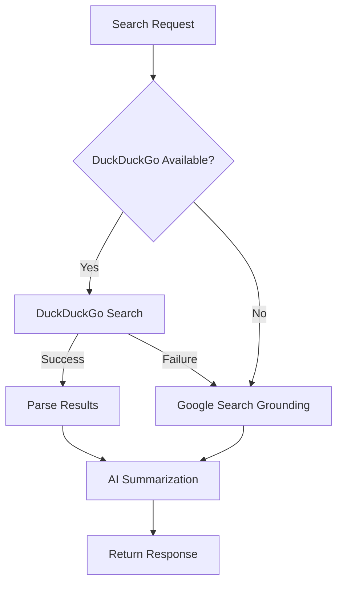

# Design Document: Multi-Model AI Support

## Overview

This design document outlines the architecture for adding multi-model AI support to CodeEx AI. The system will extend the current Genkit-based architecture to support multiple AI providers (Google, Hugging Face, OpenRouter) and models optimized for different use cases. The design prioritizes extensibility, allowing new models to be added through configuration rather than code changes.

## Architecture

```mermaid
graph TB
    subgraph Client
        UI[Settings Dialog]
        Chat[Chat Interface]
    end
    
    subgraph "Model Layer"
        MS[Model Selector]
        MR[Model Registry]
        AR[Auto Router]
        QC[Query Classifier]
    end
    
    subgraph "Provider Adapters"
      GA[Google AI Adapter (deprecated)]
      HF[Hugging Face Adapter]
      OR[OpenRouter Adapter]
    end
    
    subgraph "External APIs"
      GeminiAPI[Google Gemini API (deprecated)]
      HFAPI[Hugging Face Inference API]
      ORAPI[OpenRouter API]
    end
    
    UI --> MS
    Chat --> AR
    MS --> MR
    AR --> QC
    AR --> MR
    MR --> GA
    MR --> HF
    MR --> OR
    GA --> GeminiAPI
    HF --> HFAPI
    OR --> ORAPI
```

### High-Level Flow

1. User selects a model in settings or uses "auto" mode
2. When a message is sent, the Auto Router analyzes the query (if auto mode)
3. The Query Classifier determines the query category (coding, math, conversation, general)
4. The Model Registry returns the appropriate model configuration
5. The Provider Adapter handles the API-specific request/response transformation
6. The response is normalized and returned to the chat interface

## Components and Interfaces

### 1. Model Configuration Schema

```typescript
// src/lib/model-config.ts

export type ModelCategory = 'general' | 'coding' | 'math' | 'conversation' | 'multimodal';

export type ProviderType = 'huggingface' | 'openrouter';

export interface ModelConfig {
  id: string;                    // Unique identifier (e.g., 'qwen-72b')
  name: string;                  // Display name
  provider: ProviderType;        // Provider type
  modelId: string;               // Provider-specific model ID
  category: ModelCategory;       // Primary use case
  description: string;           // Brief description of strengths
  contextWindow: number;         // Max context length
  supportsStreaming: boolean;    // Whether streaming is supported
  defaultParams: ModelParams;    // Default generation parameters
  enabled: boolean;              // Whether model is available
}

export interface ModelParams {
  temperature: number;
  topP: number;
  topK?: number;
  maxOutputTokens: number;
}

export interface ProviderConfig {
  type: ProviderType;
  apiKeyEnvVar: string;          // Environment variable name for API key
  baseUrl?: string;              // Optional custom endpoint
  enabled: boolean;
}
```

### 2. Model Registry

```typescript
// src/lib/model-registry.ts

export interface ModelRegistry {
  getModel(id: string): ModelConfig | undefined;
  getModelsByCategory(category: ModelCategory): ModelConfig[];
  getAvailableModels(): ModelConfig[];
  getDefaultModel(category?: ModelCategory): ModelConfig;
  isModelAvailable(id: string): boolean;
}
```

### 3. Provider Adapter Interface

```typescript
// src/ai/adapters/types.ts

export interface ProviderAdapter {
  readonly provider: ProviderType;
  
  isAvailable(): boolean;
  
  generate(request: GenerateRequest): Promise<GenerateResponse>;
  
  generateStream?(request: GenerateRequest): AsyncIterable<string>;
}

export interface GenerateRequest {
  model: ModelConfig;
  prompt: string;
  systemPrompt?: string;
  history?: MessageData[];
  params?: Partial<ModelParams>;
}

export interface GenerateResponse {
  text: string;
  modelUsed: string;
  usage?: {
    promptTokens: number;
    completionTokens: number;
  };
}
```

### 4. Query Classifier

```typescript
// src/ai/query-classifier.ts

export interface QueryClassification {
  category: ModelCategory;
  confidence: number;
  reasoning?: string;
}

export interface QueryClassifier {
  classify(query: string): QueryClassification;
}
```

### 5. Auto Router

```typescript
// src/ai/auto-router.ts

export interface AutoRouter {
  selectModel(query: string, preferredCategory?: ModelCategory): ModelConfig;
}
```

## Data Models

### Extended Settings Type

```typescript
// Updated src/lib/types.ts

export type ModelId = 
  // Qwen Models
  | 'qwen-72b'
  // DeepSeek Models
  | 'deepseek-coder-33b'
  // WizardLM Models
  | 'wizardcoder-python-34b'
  | 'wizardmath-70b'
  // Meta Models
  | 'llama-2-70b'
  // Conversation Models
  | 'dialogpt-large'
  | 'blenderbot-400m'
  // Multimodal Models
  | 'kosmos-2'
  | 'blip2';

export type Settings = {
  model: 'auto' | ModelId;
  preferredCategory?: ModelCategory;  // Hint for auto mode
  tone: 'helpful' | 'formal' | 'casual';
  technicalLevel: 'beginner' | 'intermediate' | 'expert';
  enableSpeech: boolean;
  voice: Voice;
};
```

### Extended Message Type

```typescript
// Updated Message type with model attribution

export type Message = {
  id: string;
  role: 'user' | 'assistant';
  content: string;
  createdAt: string;
  modelUsed?: string;           // Model that generated this response
  modelCategory?: ModelCategory; // Category of model used
  autoRouted?: boolean;         // Whether auto-routing was used
};
```

### Model Configuration Store

```typescript
// src/lib/models-config.json (loaded at runtime)

{
    "providers": {
    "huggingface": {
      "type": "huggingface",
      "apiKeyEnvVar": "HUGGINGFACE_API_KEY",
      "baseUrl": "https://api-inference.huggingface.co",
      "enabled": true
    },
    "openrouter": {
      "type": "openrouter",
      "apiKeyEnvVar": "OPENROUTER_API_KEY",
      "baseUrl": "https://openrouter.ai/api/v1",
      "enabled": true
    }
  },
  "models": [
    {
      "id": "qwen-72b",
      "name": "Qwen 2.5 72B Instruct",
      "provider": "huggingface",
      "modelId": "Qwen/Qwen2.5-72B-Instruct",
      "category": "general",
      "description": "Excellent at code generation, math, and multilingual support",
      "contextWindow": 32768,
      "supportsStreaming": true,
      "defaultParams": {
        "temperature": 0.7,
        "topP": 0.9,
        "maxOutputTokens": 4096
      },
      "enabled": true
    }
  ]
}
```


## Mobile UI Components

### Responsive Model Selector

```typescript
// src/components/mobile-model-selector.tsx

interface MobileModelSelectorProps {
  models: ModelConfig[];
  selectedModel: string;
  onSelect: (modelId: string) => void;
  isOpen: boolean;
  onClose: () => void;
}
```

The mobile model selector will use:
- Bottom sheet pattern (slides up from bottom)
- Collapsible accordion for categories
- Touch-friendly tap targets (min 44x44px)
- Swipe-to-dismiss gesture support
- Uses `@radix-ui/react-dialog` with mobile-specific styling

### Mobile Breakpoints

```css
/* Responsive breakpoints */
@media (max-width: 640px) {
  /* Mobile: Full-width bottom sheet */
}
@media (min-width: 641px) and (max-width: 1024px) {
  /* Tablet: Side panel or modal */
}
@media (min-width: 1025px) {
  /* Desktop: Dropdown in settings dialog */
}
```

## Search Integration (DuckDuckGo)

### DuckDuckGo API Integration

```typescript
// src/lib/duckduckgo.ts

export interface DuckDuckGoResult {
  title: string;
  url: string;
  snippet: string;
}

export interface DuckDuckGoSearchResponse {
  results: DuckDuckGoResult[];
  query: string;
}

export async function searchDuckDuckGo(query: string): Promise<DuckDuckGoSearchResponse>;
```

### Search Flow Architecture

```mermaid
graph LR
    A[/search query] --> B[Query Encoder]
    B --> C{DuckDuckGo API}
    C -->|Success| D[Results Parser]
    C -->|Failure| E[Google Search Fallback]
    D --> F[AI Summarization]
    E --> F
    F --> G[Response with Sources]
```

## Command Routing

### Enhanced Command Router

```typescript
// src/ai/command-router.ts

export type CommandType = 'solve' | 'search' | 'summarize' | 'general';

export interface CommandRoute {
  command: CommandType;
  preferredCategory: ModelCategory;
  fallbackCategory: ModelCategory;
}

export const COMMAND_ROUTES: Record<string, CommandRoute> = {
  '/solve': {
    command: 'solve',
    preferredCategory: 'math',
    fallbackCategory: 'general',
  },
  '/search': {
    command: 'search',
    preferredCategory: 'general',
    fallbackCategory: 'general',
  },
  '/summarize': {
    command: 'summarize',
    preferredCategory: 'general',
    fallbackCategory: 'general',
  },
};
```

## Correctness Properties

*A property is a characteristic or behavior that should hold true across all valid executions of a system-essentially, a formal statement about what the system should do. Properties serve as the bridge between human-readable specifications and machine-verifiable correctness guarantees.*

Based on the prework analysis, the following properties have been identified. After reflection to eliminate redundancy, properties testing similar behaviors have been consolidated.

### Property 1: Model Selection Persistence Round-Trip

*For any* valid model ID, persisting the selection to local storage and then reading it back SHALL return the same model ID.

**Validates: Requirements 1.2**

### Property 2: Model Display Information Completeness

*For any* model configuration in the registry, the display representation SHALL contain the model name, provider name, and description.

**Validates: Requirements 1.3**

### Property 3: Fallback Model Validity

*For any* unavailable model selection, the fallback mechanism SHALL return a valid, available model from the registry.

**Validates: Requirements 1.4**

### Property 4: Auto-Router Category Consistency

*For any* query and its classification result, when auto-routing is enabled, the selected model's category SHALL match the classified query category (coding → coding model, math → math model, general → general model).

**Validates: Requirements 2.1, 2.2, 2.3**

### Property 5: Query Classifier Output Validity

*For any* non-empty query string, the query classifier SHALL return a valid ModelCategory and a confidence score between 0 and 1.

**Validates: Requirements 2.4**

### Property 6: Model Configuration Round-Trip

*For any* valid ModelConfig object, serializing to JSON and then parsing back SHALL produce an equivalent ModelConfig object.

**Validates: Requirements 3.4**

### Property 7: Configuration Schema Validation

*For any* input object, the configuration parser SHALL either return a valid ModelConfig or throw a validation error; it SHALL never return an invalid configuration.

**Validates: Requirements 3.5**

### Property 8: Response Model Attribution

*For any* generated response, the resulting Message object SHALL contain a non-empty modelUsed field identifying the model that generated it.

**Validates: Requirements 4.1**

### Property 9: Auto-Route Reasoning Presence

*For any* response generated via auto-routing, the Message SHALL include routing reasoning explaining why that model was selected.

**Validates: Requirements 4.3**

### Property 10: Provider Availability on Missing Key

*For any* provider configuration where the API key environment variable is not set, all models from that provider SHALL be marked as unavailable in the registry.

**Validates: Requirements 5.2**

### Property 11: Provider Exclusion on Auth Error

*For any* provider that returns an authentication error, all models from that provider SHALL be excluded from the available models list.

**Validates: Requirements 5.4**

### Property 12: Response Format Normalization

*For any* raw response from any provider adapter, the normalized output SHALL conform to the GenerateResponse interface with required text and modelUsed fields.

**Validates: Requirements 6.1**

### Property 13: Error Message Standardization

*For any* error thrown by any provider adapter, the transformed error SHALL be an instance of a standard error type with a user-friendly message.

**Validates: Requirements 6.3**

### Property 14: Mobile Tap Target Size

*For any* model option element rendered at mobile viewport widths, the computed dimensions SHALL be at least 44x44 pixels.

**Validates: Requirements 7.3**

### Property 15: Search Query Encoding

*For any* search query string containing special characters (spaces, &, ?, =, etc.), the encoded query sent to DuckDuckGo SHALL be a valid URL-encoded string.

**Validates: Requirements 8.3**

### Property 16: Search Fallback Behavior

*For any* DuckDuckGo API failure, the system SHALL successfully fall back to Google Search grounding and return a valid response.

**Validates: Requirements 8.4**

### Property 17: Solve Command Math Model Routing

*For any* /solve query when auto-routing is enabled, the selected model SHALL be from the 'math' category (or fallback to 'general' if no math models available).

**Validates: Requirements 9.1, 9.3**

### Property 18: Math Solution LaTeX Formatting

*For any* mathematical problem solution, the output SHALL contain valid LaTeX formatting markers (e.g., $, $$, \frac, \sqrt).

**Validates: Requirements 9.2**

### Property 19: Code Detection in Solve Queries

*For any* /solve query containing code patterns (function definitions, variable assignments, loops), the system SHALL detect the code presence and may route to a coding model.

**Validates: Requirements 9.4**

### Property 20: Command Model Preference Respect

*For any* special command (/solve, /search, /summarize) when auto-routing is disabled, the system SHALL use the user's explicitly selected model.

**Validates: Requirements 10.2**

### Property 21: Command Auto-Route Category Match

*For any* special command when auto-routing is enabled, the selected model's category SHALL match the command's preferred category mapping (/solve → math, /search → general, /summarize → general).

**Validates: Requirements 10.3**

## Error Handling

### Provider Errors

| Error Type | Handling Strategy |
|------------|-------------------|
| Missing API Key | Disable provider, log warning, exclude models from selection |
| Authentication Error | Mark provider unavailable, notify user, suggest checking API key |
| Rate Limit | Retry with exponential backoff (max 3 attempts), then fallback to alternate model |
| Network Error | Retry once, then show connection error message |
| Invalid Response | Log error, return standardized error message to user |
| Model Not Found | Fall back to default model, log warning |

### Error Response Format

```typescript
export interface AIError {
  code: 'AUTH_ERROR' | 'RATE_LIMIT' | 'NETWORK_ERROR' | 'INVALID_RESPONSE' | 'MODEL_UNAVAILABLE';
  message: string;           // User-friendly message
  provider?: ProviderType;   // Which provider failed
  modelId?: string;          // Which model was requested
  retryable: boolean;        // Whether the operation can be retried
}
```

### Fallback Chain

1. If selected model fails → Try alternate model in same category
2. If category has no available models → Fall back to default general model
3. If default model fails → Return error with helpful message

## Testing Strategy

### Property-Based Testing Library

This project will use **fast-check** for property-based testing in TypeScript. Fast-check provides:
- Arbitrary generators for complex data types
- Shrinking to find minimal failing examples
- Integration with Jest/Vitest test runners

### Test Configuration

Each property-based test will be configured to run a minimum of 100 iterations.

### Unit Tests

Unit tests will cover:
- Model registry CRUD operations
- Query classifier with specific example queries
- Provider adapter initialization
- Settings persistence edge cases

### Property-Based Tests

Each correctness property will be implemented as a property-based test with the following annotation format:

```typescript
// **Feature: multi-model-support, Property 1: Model Selection Persistence Round-Trip**
```

### Test Categories

1. **Model Registry Tests**
   - Property 2: Display information completeness
   - Property 3: Fallback model validity
   - Property 10: Provider availability on missing key
   - Property 11: Provider exclusion on auth error

2. **Auto-Router Tests**
   - Property 4: Auto-router category consistency
   - Property 5: Query classifier output validity
   - Property 9: Auto-route reasoning presence

3. **Configuration Tests**
   - Property 6: Model configuration round-trip
   - Property 7: Configuration schema validation

4. **Response Handling Tests**
   - Property 8: Response model attribution
   - Property 12: Response format normalization
   - Property 13: Error message standardization

5. **Persistence Tests**
   - Property 1: Model selection persistence round-trip

6. **Mobile UI Tests**
   - Property 14: Mobile tap target size

7. **Search Integration Tests**
   - Property 15: Search query encoding
   - Property 16: Search fallback behavior

8. **Command Routing Tests**
   - Property 17: Solve command math model routing
   - Property 18: Math solution LaTeX formatting
   - Property 19: Code detection in solve queries
   - Property 20: Command model preference respect
   - Property 21: Command auto-route category match

### Test File Structure

```
src/
├── lib/
│   ├── __tests__/
│   │   ├── model-registry.test.ts
│   │   ├── model-registry.property.test.ts
│   │   ├── model-config.property.test.ts
│   │   └── duckduckgo.property.test.ts
├── ai/
│   ├── __tests__/
│   │   ├── query-classifier.test.ts
│   │   ├── query-classifier.property.test.ts
│   │   ├── auto-router.property.test.ts
│   │   ├── command-router.property.test.ts
│   │   └── adapters/
│   │       └── response-normalizer.property.test.ts
├── components/
│   └── __tests__/
│       └── mobile-model-selector.test.tsx
└── hooks/
    └── __tests__/
        └── use-model-settings.property.test.ts
```

## DuckDuckGo Integration Details

### API Endpoint

DuckDuckGo provides an Instant Answer API that can be used for search:

```typescript
// Base URL for DuckDuckGo API
const DUCKDUCKGO_API = 'https://api.duckduckgo.com/';

// Query parameters
interface DuckDuckGoParams {
  q: string;      // Search query
  format: 'json'; // Response format
  no_html: '1';   // Strip HTML from responses
  skip_disambig: '1'; // Skip disambiguation
}
```

### Fallback Strategy


